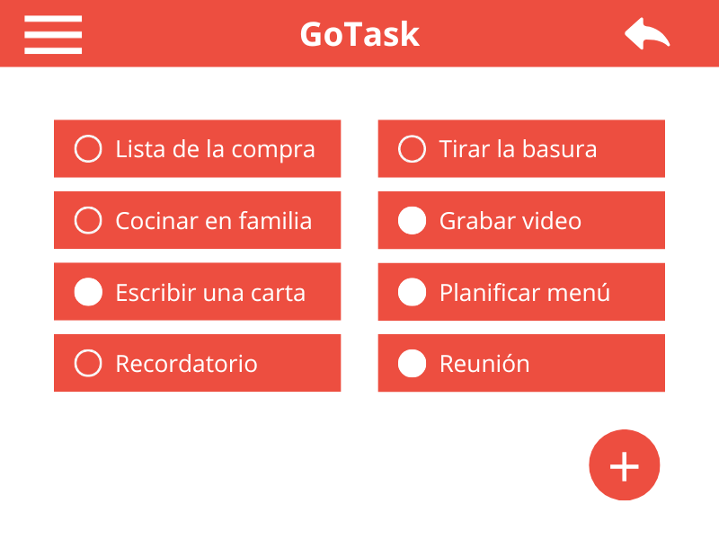

# 🚀 GoTask: Streamline Your Productivity

[](LICENSE) [](https://github.com/R4F405/gotask)

> *Organize. Collaborate. Achieve.*



## 📋 Table of Contents
- [What is GoTask?](#what-is-gotask)
- [✨ Features](#features)
- [🎮 Getting Started](#getting-started)
- [🔄 Project Status](#project-status)
- [💻 Installation](#installation)
- [⚙️ System Requirements](#system-requirements)
- [👥 Get Involved](#get-involved)
- [📄 License](#license)
- [📞 Contact](#contact)

## What is GoTask?

**GoTask** transforms how you manage your tasks and projects. Designed to adapt to both your personal pace and your team's workflow, this application combines power and simplicity so you never lose control of your goals again.

### Who is it for?

- 🎓 **Students** juggling classes, assignments, and social life
- 💼 **Professionals** needing to keep their projects pTM-organized
- 👪 **Families** looking to coordinate activities and responsibilities
- 👥 **Teams** seeking to optimize their collaborative workflow

## Features

### 🧠 Intuitive Management
Drag, drop, reorganize, and complete tasks with an interface that thinks like you do. No steep learning curves, just instant productivity.

### 👥 Frictionless Collaboration
Create shared spaces where every member can contribute in real-time. Comment, assign, and track progress without leaving the application.

### 🎨 Tailored Customization
Adapt GoTask to your work style with color-coded labels, custom priorities, and views that fit your specific needs.

### 🔒 Unbreakable Security
Your information is protected with military-grade encryption. Focus your energy on what's important while we take care of keeping your data secure.

### Why Choose GoTask?

- ⚡ **Agility**: An interface that responds to your needs without hindering your flow
- 🤝 **Versatility**: Perfect for both individual use and teams of any size
- 🛠️ **Adaptability**: It molds to your way of working, not the other way around
- 🔐 **Trust**: Robust security that protects your information without complications

## Getting Started

Taking the first step with GoTask is as simple as:

1. Registering with your email address
2. Customizing your workspace
3. Creating your first tasks or projects
4. Inviting collaborators (optional!)

## Project Status

GoTask is constantly evolving. We are committed to continuous improvement, implementing new functionalities based on feedback from our user community. Your opinion counts!

## Installation

### Important Prerequisites:

- ⚠️ **Compatibility**: Currently optimized for IntelliJ IDEA
- ☕ **Java**: Requires JRE 21 (older versions do not guarantee correct functionality)
- 🗄️ **Database**: Tested and optimized for MySQL WorkBench 8.0 CE

### Installation Steps:

1. **Clone the repository** (preferably from IntelliJ):
   ```bash
   git clone https://github.com/R4F405/gotask.git
   ```

2. **Open the project** in IntelliJ IDEA

3. **Configure the connection** to the MySQL database

4. **Run the application** and start enjoying a new task management experience

## System Requirements

For an optimal experience with GoTask, ensure you have:

- **Operating System**: Windows
- **Java**: JRE 21
- **Memory**: 2 GB RAM minimum recommended
- **Storage**: 1 GB of free space
- **Permissions**: Administrator level for initial installation

## Get Involved

Have ideas to improve GoTask? We'd love to have you on board! Follow these steps:

1. Fork the repository
2. Clone your fork locally
3. Create a branch for your contribution (`git checkout -b my-new-feature`)
4. Implement your changes and test their functionality
5. Submit a pull request detailing your improvements

## License

GoTask is distributed under the GNU GPL v3.0 license. See the [LICENSE](LICENSE) file for more details.

## Contact

Questions, suggestions, or just want to say hello? Write to us at:

📧 contacto@gotask.com

---

*GoTask: Where tasks become achievements.*
